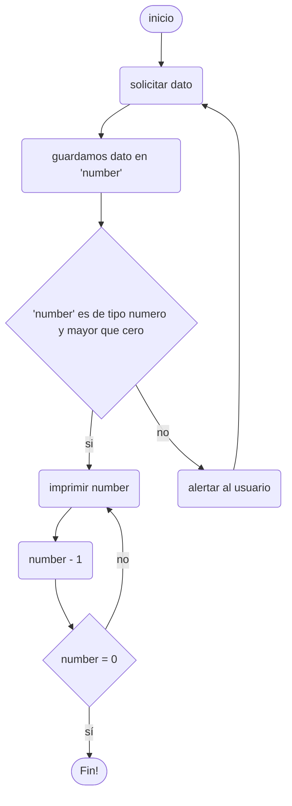

# Primer ejercicio DDF

Descripcion:

VAGO:

Representa un algoritmo que cuente de un numero hacia abajo

Específico:

Representa un algoritmo que imprima en la consola los numeros empezando en un numero dado por el usuario hasta el 1.

Entradas:

- numero que provee el usuario (type: number)

Proceso:

() para rectangulo

{} para rombo



Salida:

(asumiendo que el numero proveido por el usuario es 5)

```bash
5
4
3
2
1
```
